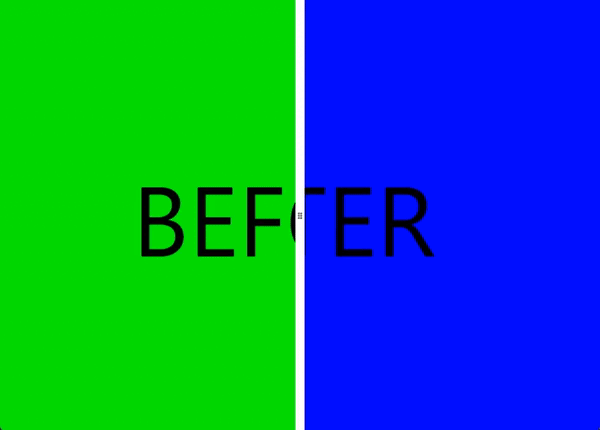

<a href="https://www.buymeacoffee.com/numq"></a>

# Compose Before After

**_Jetpack Compose Before After Component_** is a container component that allows you to show the contents of one
component on top of another, adjusting its display ratio using a slider position, which is useful for comparison.



## Installation

```
repositories {
    maven("https://jitpack.io")
}

dependencies {
    implementation("com.github.numq:compose-before-after:1.0.0")
}
```